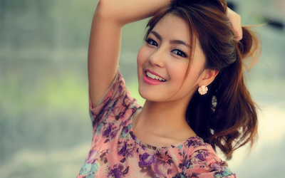

# ASCIIFY: ASCII ART GENERATOR
 This is one of the projects for [ACM IITR](https://github.com/acmiitr)'s open projects for summer 2022.

ASCII(American Standard Code for Information Interchange) is a common encoding format used for representing strings and text data in computers.

But…what if we use this for something other than text?

How about images? 
 Here images can be turned into ASCII encoded strings that look like the image.  Not just images, how about videos that are asciified??
 
 For this some basic image processing techniques are used to convert an image
 or video(.mp4) into an ASCII art. We can also convert images or videos into asciified sketches using the same. 
## How to run
To run this on your local machine, clone the repo:
	
	git clone https://github.com/st3rl4nce/ascii-art-generator.git
### Install Dependencies
run:

	pip install -r requirements.txt
### Asciified-Video
run:

	python ascii.py "./data/inp_v.mp4" "./data/out.mp4"

Flags:
		
	Different optional flags can be used to change the way the output is rendered:
	
	-bg : To specify the background color of the output ascii video => 
		  -bg=0:black, -bg=1:white(default).
		  
	-s : To specify whether the video should be skechified before asciifying => 
	     -s=True:skechify+asciify, -s=False:just asciify(default). 
	
	-gs : To specify(if skechified)whether the skechified video should be grayscale
		  (pencil sketch like) or colored=> 
	  	  -gs=True:grayscale, -gs=False:color(default).
	  
	Here "./data/inp_v.mp4", "./data/out.mp4" are just the relative paths of the input and output files. 
	Any video input and output can be specified as long as the output is of mp4 format. 

### Skechified Image
run:

	python sketchify.py "./data/sample.jpeg" "./data/sampleout.png" 

flags:
		
	Different optional flags can be used to change the way the output is rendered:
	
	-a : To specify whether the skechified image should be asciified or not =>
			-a=False: Only Skechify, -a=True: skechify+asciify(default). 
		  
	-gs : To specify(if skechified)whether the skechified video should be grayscale
		  (pencil sketch like) or colored=> 
	  	  -gs=True:grayscale, -gs=False:color(default).
	  	  
	-bg : To specify the background color of the output asciified sketch => 
		  -bg=0:black, -bg=1:white(default).
	  
	Here "./data/sample.jpeg", "./data/sampleout.png" are just the relative paths of the input and output files. 
	
	Any file can be specified as input and output as long as it is an image file. 
### Asciified Images
run:

	python asciifyImg.py "./data/sample.jpeg" "./data/sampleout.png"

flags:
		
	We can use different optional flags to change the way the output is rendered:
	
	-bg : To specify the background color of the output ascii image => 
		  -bg=0:black, -bg=1:white(default).
		  	  
	Here "./data/sample.jpeg" "./data/sampleout.png" are just the relative paths of the input and output files. 
	
	Any file can be specified as input and output as long as it is an image file. 
	
## Internal working of the project   
### ASCIIfying an image: 
1. We know that images are stored as pixels, with each pixel containing some data depending on the image scheme(like RGB, HSV).
 
2. Now to convert our input into an ascii art we have to map each of those pixels with some ASCII characters without losing the color data of the image. 

3. Since the ASCII characters are not square like(and pixels are), we will be upscaling them to get more square like to serve our needs.

4. We will limit the width of our image by specifying the number of columns as a constant.

5. Now, we claculate the dimensions(height, width) of each pixel using scale value and the specified number of columns.

6. Then, the dimensions of the ouptput image are calculated using no. of columns, rows and size of each ASCII char after upscaling. 

7. We'll create a new RGB output using PIL, and write(using ```ImageDraw```) to it from our input image. (Note: OpenCV uses BGR whereas PIL uses RGB, so take care). 

8. Now, find out the no.of pixels of input image contribute to one pixel of output image, and use the average(can also use weighted means) value of those pixels to give color to the output ASCIIfied pixel. 

9. As a final step we'd be fixing the overflows in borders(using ```getbox()```) after inverting it and finally save it to the specified location.

### For Sketchifying an image:

1. To skechify an image, we first invert it, and then blur it(using ```GaussianBlur``` from OpenCV), and reinvert it. 

2. Now, we merge the original image and the blurred image using bitwise division(```divide``` from OpenCV), and write it to a file and save it. 

3. To make the sketch similar to a pencil sketch we have to first grayscale(using ```cvtColor``` of OpenCV) the image and then execute the steps 1, 2. 

### For ASCIIfying a video:

1. We know that videos are nothing but a stream of images. 

2. Owing to this fact, if we were to modify each image of the stream we would have modified the video as a whole. 

3. So, we need a way to extract these frames from the video, which can be done pretty easily by using ```VideoCapture``` package of OpenCV
    
4. Using ```VideoCapture``` package from OpenCV we will access each frame and save it to our temporary folder.

5. Now, we will extract the frame and save it as an image and asciify/skechify/both it(from previous sections), and write the output to the video using ```VideoWriter``` package.

6. We could also have saved all the frame's outputs and combined them at the end to make the video, but it would have taken a high amount of space. Here, we are using only two temporary image files, which will be deleted at the end(using functions from ```os``` library). 

## Demo
### ASCIIfying an image:

 &emsp; 
		
### Sketchifying an image:
 &emsp;  &emsp; 
## Your learning takeaways from the project  
## The  resources/references you used while working on the project